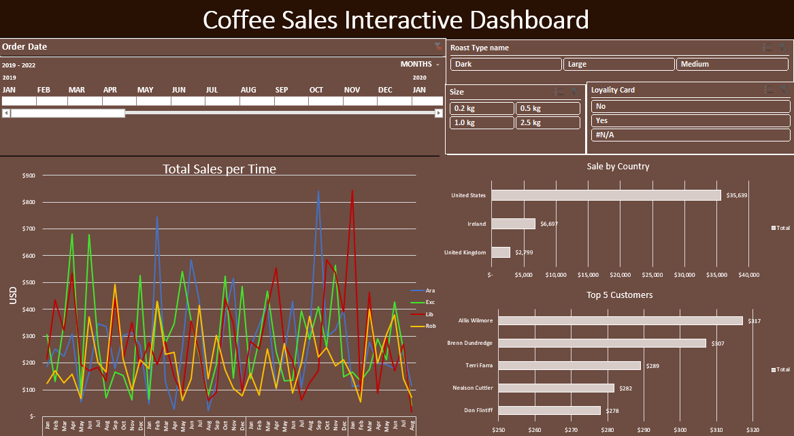

# ☕ Coffee Sales Data Analysis & Dynamic Dashboard

## 📌 Project Overview (نظرة عامة على المشروع)
This project is an end-to-end data analysis portfolio project using **Microsoft Excel**. The goal was to transform raw, messy datasets spread across multiple sheets (Orders, Customers, Products) into a clean, consolidated dataset, and ultimately build a fully interactive, dynamic dashboard to uncover key business insights regarding coffee sales.

هذا المشروع عبارة عن تحليل متكامل لبيانات مبيعات القهوة باستخدام **MS Excel**. يهدف المشروع إلى تنظيف ومعالجة بيانات خام موزعة على عدة جداول، وتحويلها إلى لوحة تحكم (Dashboard) تفاعلية وديناميكية تساعد في اتخاذ القرارات التجارية.

## ⚙️ The ETL Process (مرحلة معالجة البيانات)
The raw data was provided in three separate tables. I performed Data Extraction, Transformation, and Loading (ETL) to build a master dataset:
* **Data Integration:** Utilized advanced functions like `XLOOKUP` and 2D `INDEX/MATCH` to seamlessly merge customer details and product specifications into the main Orders table.
* **Data Cleaning & Decoding:** Replaced short-codes (e.g., 'ROB', 'M') with descriptive names ('Robusta', 'Medium') using nested `IF` statements.
* **Formatting:** Applied custom number formatting for currencies (USD), weights (KG), and dates (DD-MMM-YYYY) to enhance readability.
* **Data Quality:** Removed duplicates to ensure 100% data integrity.

## 📊 Interactive Dashboard Features (مميزات لوحة التحكم)
Built a dynamic dashboard driven by Pivot Tables and Report Connections, enabling seamless data slicing and dicing:
1. **Sales Over Time (Line Chart):** Tracks monthly and yearly revenue trends.
2. **Sales by Country (Bar Chart):** Highlights the most profitable geographic regions.
3. **Top 5 Customers (Column Chart):** Identifies the most valuable clients using Value Filters.
4. **Dynamic Slicers & Timeline:** Connected filters for *Roast Type, Size, Loyalty Card, and Order Date* that instantly update all visualizations simultaneously.

## 🛠️ Skills & Technologies Demonstrated
* **Tool:** Microsoft Excel
* **Functions:** `XLOOKUP`, `INDEX`, `MATCH`, Nested `IF`, Data Formatting.
* **Analysis:** Pivot Tables, Data Aggregation, Top 'N' Filtering.
* **Visualization:** Pivot Charts (Line, Bar, Column), Interactive Slicers, Timelines, Report Connections.

## 💡 Key Business Insights (أهم النتائج)
* The highest sales were generated in the United States, followed by Ireland.
* 'Arabica' coffee with a 'Medium' roast is the most popular product among top customers.
* Peak sales typically occur during the final quarter of the year.

## 📂 Project Structure (هيكلة الملفات)
- `Raw_Data/`: Contains the initial, unprocessed Excel files.
- `Cleaned_Data_and_Dashboard/`: The final `.xlsx` file containing the ETL process, Pivot Tables, and the Dynamic Dashboard.
- `Screenshots/`: High-resolution images of the dashboard in action.

---
*If you find this project helpful, feel free to ⭐ the repository!*
